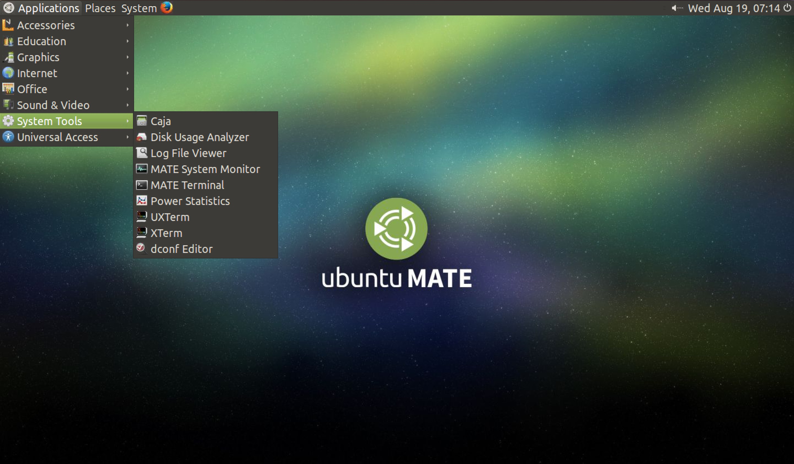

Découverte rapide du Bureau MATE
================================

Ce bureau est très similaire aux bureaux que vous avez pu rencontrer sous l'environnement Windows (XP, Seven,...) ou le système OSX sous Mac.

Vous disposez d'un bureau contenant une **barre des tâches** dans la partie supérieure et un **menu Application** dans la partie  supérieure gauche. Dans ce menu vous trouverez un certains nombre de sous menus vous permettant d'accéder à des applications (e.g Firefox, Chrome, Libreoffice,...).
     
.. important::  Pour la suite nous aurons besoin de lancer un terminal (!). Pour lancer ce terminal, sélectionnez dans le menu : **Application > System tools > MATE terminal**.

         
   Le bureau MATE avec sa configuration par défaut. 

Analyser la qualité avec fastqc 
===============================

La commande fastqc
-------------------

 On peut utiliser la commande fastqc pour analyser la qualité des reads. Il faudra lui fournir un certain nombre d'arguments. La syntaxe générale est la suivante:

 :: 

   fastqc [-o output dir] [--(no)extract] [-f fastq|bam|sam] fq1 fq2 fq3 ...

 Ici nous souhaitons stocker le résultat de fastqc (un dossier contenant une page web) dans le dossier chipseq_tuto/fastqc/siNT_ER_E2_r3_SRX176860_chr21_0.6_Noise. Nous devons tout d'abord créer ce fichier puis lancer fastqc:

.. code-block:: bash 

   $ cd chipseq_tuto/fastqc
   $ mkdir chipseq_tuto/fastqc/siNT_ER_E2_r3_SRX176860_chr21_0.6_Noise
   $ fastqc -f fastq -o siNT_ER_E2_r3_SRX176860_chr21_0.6_Noise ../raw_data/siNT_ER_E2_r3_SRX176860_chr21_0.6_Noise.fastq 

 Pour visualiser le résultat on peut directement demander à firefox de l'ouvrir:

.. code-block:: bash

   $ firefox siNT_ER_E2_r3_SRX176860_chr21_0.6_Noise/.../...

.. todo:: finir ce qu'il y a au-dessus.

Rogner les reads 
=================

La commande sickle
---------------------

 Cette commande va nous permettre de trimmer les reads. Ici nous travaillons avec des données 'single-end' nous travaillerons donc avec 'sickle se' (voir 'sickle pe' pour le paired-end). Les arguments de sickle sont les suivants:

.. code-block:: bash

    $ sickle 
    
    Usage: sickle <command> [options]
    
    Command:
    pe  paired-end sequence trimming
    se  single-end sequence trimming
    
    --help, display this help and exit
    --version, output version information and exit

.. code-block:: bash

    $ sickle se 
    Usage: sickle se  -f <fastq sequence file>  -t <quality type> -o <trimmed fastq file> 
    Options: 
    -f, --fastq-file, Input fastq file (required)
    -t, --qual-type, Type of quality values (solexa (CASAVA < 1.3), illumina
    (CASAVA 1.3 to 1.7), sanger (which is CASAVA >= 1.8)) (required) 
    -o, --output-file, Output trimmed fastq file (required) 
    -q, --qual-threshold, Threshold for trimming based on average quality in a window. Default 20. 
    -l, --length-threshold, Threshold to keep a read based on length after trimming. Default 20. 
    -x, --no-fiveprime, Don't do five prime trimming. 
    -n, --discard-n, Discard sequences with any Ns in them. 
    --quiet, Don't print out any trimming information 
    --help, display this help and exit --version, output version information and exit