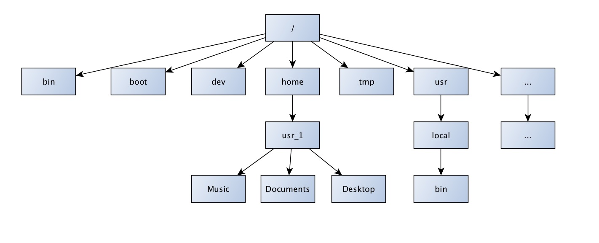

L'arborescence sous Linux 
==========================

Fichiers et dossier 
--------------------

Au même titre que sous windows, les données sous unix sont contenues dans des **fichiers** qui eux même peuvent être contenus dans des **dossiers**. 

Afin de faciliter l'apprentissage des chemins sous Unix, nous allons utiliser le navigateur de fichier dans un premier temps. 

.. important:: Lancez le navigateur de fichier en utilisant le menu "Places > Home folder".

Dossier racine 
----------------

Sous windows, **la racine du disque** système est désignée par **C:\\**. Sous UNIX la racine est désignée par **"/"**. 

Dans cette racine on trouve un certain nombre de répertoires: La liste de ces répertoire peut varier d'un système à l'autre (Ubuntu, Centos, OSX...).

   * /root Répertoire personnel (:fonticon:`fa fa-home icon-2x`) de l'administrateur (appelé "root").
   * /home Répertoires des utilisateurs (:fonticon:`fa fa-home icon-2x`).
   * /bin Programmes système (binaries). * /tmp Données temporaires.
   * /boot Noyau, Bootmanager. * /dev Fichiers des périphériques (devices).
   * /etc Fichiers de configuration. * /lib Librairies partagées.
   * /mnt Répertoire de montage pour cdrom, floppy... (mount).
   * /opt Installations supplémentaires.
   * /proc Informations sur le système et les processus en cours (process).
   * /sbin Programmes système pour le root.
   * /usr Programmes des utilisateurs.
   * /var Fichiers divers et certains fichiers de logs (variable) .. 

   Schéma simplifié de l'arborescence d'un système Unix.

Chemins absolus et chemins relatifs
------------------------------------

Lorsqu'on désignera un dossier ou un fichier chemin on pourra utiliser son **chemin relatif ou son chemin absolu**. 

Le **chemin absolu** correspond au chemin (la succession de dossiers à ouvrir) qui depuis la racine de l'arborescence permet d'accèder à l'élément en question. Le **chemin absolu** est non ambigu et on peut l'utiliser quel que soit le dossier dans lequel on se trouve. Exemple de chemin absolu: 

.. code-block:: bash

   /usr/share/icons/hicolor/512x512

.. admonition:: Exercice
   :class: exo
   
   * Dans le navigateur de fichier, vous apercevrez une icône en forme de crayon. Cliquez sur le crayon. Dans la zone de saisie qui apparait. Tapez le chemin suivant:
   
   * Placez vous dans le repértoire  /root/Desktop
   * Déplacez vous dans    /usr/share/icons/hicolor/512x512
   * Déplacer vous dans /root 
   * Déplacez vous dans /usr/share/icons/hicolor/512x512

Le **chemin relatif** est une autre solution permettant de désigner un dossier ou un fichier. Cependant, l'écriture se réfère à votre position à l'instant t dans l'arborescence. En écriture relative, certains opérateurs sont particulièrement utiles:

.. code-block:: bash 

   .. # Désigne le répertoire supérieur dans l'arborescence. 
   ../.. # Désigne deux répertoires supérieurs dans l'arborescence.   
   ../../.. # Désigne trois répertoires supérieurs dans l'arborescence (...). 
   ./ # Désigne le répertoire dans lequel on se trouve . # Désigne le répertoire dans lequel on se trouve
   

En **écriture relative** si l'on se trouve dans un dossier (e.g '/') qui contient un dossier (e.g 'root') on peut directement utiliser le nom du dossier comme chemin. Par exemple si je suis dans le dossier racine ('/') je peux écrire :

.. code-block:: bash 
   
   root  # Sans le prefixe '/' !
   ./root # En préfixant avec ./
   root/Desktop # Le dossier Desktop qui se trouve dans le dossier root. 
   
En effet ce dossier est visible qu'en je suis localisé dans le dossier '/'. Par contre si je suis dans le dossier /root/Desktop, je ne pourrai pas faire référence à ce chemin (i.e root) car ce dossier n'existe pas dans le dossier courant.

.. important:: Sous Linux/UNIX on parle de répertoire **home** pour désigner le répertoire contenant les données d'un utilisateur connecté. La représentation symbolique de ce répertoire utilisateur est **~**.

.. admonition:: Exercice
   :class: exo
      
   * Dans le navigateur de fichier, vous apercevrez une icône en forme de crayon. Cliquez sur le crayon. Dans la zone de saisie qui apparait, tapez successivement les chemins ci-dessous en tapant sur la touche Enter à chaque fois. Qu'observez vous ?
      * /
      * /bin
      * /root
      * /tmp/
      * /usr/local
      * /usr/local
      * /usr/local/..
      * /usr/local/../..
      * /usr/local/
      * ../..
      * /
      * root/Desktop # Notez qu'il n'y a pas de prefixe '/'. Pourquoi ?
      * /
      * Desktop # Ne fonctionne pas !! Pourquoi ?
      
   

   * Que se passe-t-il maintenant si vous tapez:
      * ~
      * ~/Desktop

