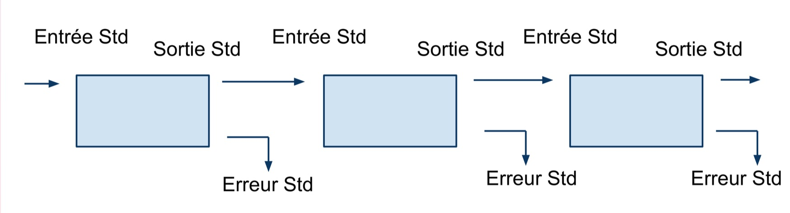

Redirections
============

Que se passe-t-il maintenant si l'on souhaite visualiser exclusivement la ligne 29, en hommage au finistériens qui nous accueillent ? Pour ce faire on pourrait récupérer les 29 premières lignes du fichier avec la commande head puis demander à tail de prendre la dernière de cette liste. Nous allons devoir ici introduire une nouvelle notions, les redirections.

Vision schématique d'un filtre Unix
-----------------------------------

Une large partie des commandes Unix peuvent être considérées comme des filtres. On peut se les représenter comme des éléments capables de réaliser une tâche sur un **flux de texte** (e.g le modifier). Pour faire cela elles sont capables de :

 * Lire via **l'entrée standard** (STDIN). Permet de lire du texte.
 * D'écrire sur une **sortie standard** (STDOUT). Cette sortie standard est l'écran par défaut comme nous avons pu le voir avec head et tail.
 * D'écrire sur une **sortie d'erreur (STDERR)**. Permet de re-diriger les messages d'erreurs d'une commande dans un fichier. Certaine commandes utilisent aussi cette sortie pour écrire des informations durant le déroulement du programme. 

Etant donné que c'est commande peuvent lire et écrire un flux de texte on devrait donc pouvoir les chaîner.

   Vision schématique d'un enchaînement de commandes Unix.

Le tube
-------

L'opérateur permettant de chaîner des commandes est le tube ('pipe'). On pourra donc typiquement écrire des instructions du type:

::

   cmd1 | cmd2 | cmd3 | ...
   

.. note:: 

   * Sur un clavier PC, le tube est généralement obtenu via le raccourci AltGr + 6.
   * Sous mac il faudra utiliser le raccourci  Alt+Shift+l
   
Voilà nous avons tous les ingrédients pour récupérer la lignes 29 (je mesure d'ici l'allégresse de nos hôtes). 

.. admonition:: Exercice (hommage au finistère)
   :class: exo
   
   * Ecrivez une commande permettant de récupérer la ligne 29.
   
      .. code-block:: bash
      
      $ head -n 9 siNT_ER_E2_r3_chr21.fastq | tail -n 1 
      
.. admonition:: Exercice (hommage à Marseille)
   :class: exo
   
   * Ecrivez une commande qui permet de récupérer les 51 premières lignes du fichier et de les regarder avec la commande less.
 
   .. code-block:: bash
   
      $ head -n 51 siNT_ER_E2_r3_chr21.fastq | less 

Autres opérateurs de redirection
--------------------------------

On a pas toujours envie de renvoyer le flux de texte dans un commande. Parfois on souhaite renvoyer le flux de texte dans un fichier afin de saugarder un résultat. On dispose alors des opérateurs suivants:

 .. code-block:: bash
   
   * > filename # redirige dans le fichier filename (et écrase se fichier si il existait) 
   * >> filename # ajoute des lignes dans le fichier filename (en le créant si il n'existait pas)
   * 2> filename # redirige l'erreur standard dans un fichier nommé filename.
   * &> filename # redirige la sortie standard et l'erreur standard dans un seul et même fichier nommé filename. 
   
