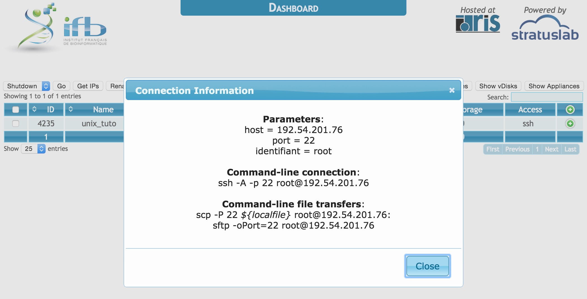

Accéder au bureau distant 
====================================

Créer une instance dans le cloud IFB 
------------------------------------

Pour accéder au bureau virtuel nous devons tout d'abord créer une instance de machine à l'IFB.

* Rendez vous sur la `page de login <http://tinyurl.com/owa7d29>`_.

* Complétez le formulaire avec votre login et votre mot de passe.

* Cliquez sur **new instance**.

   * Positionnez **Choose the Appliance > Appliance** sur **TODO**.
   * Positionnez **Configure you virtual machine > Name** sur **unix_tuto**.
   * Positionnez **Configure you virtual machine > Type** sur **c2.large**. 
   * Cliquez **run**. La nouvelles instance devrait apparaître dans le tableau (rafraîchissez éventuellement votre navigateur internet). 

   * Regardez la colonne **access** dans le tableau. Votre instance devrait rapidement être accessible par **ssh**.
   * Cliquez sur **ssh** dans la colonne **access**. 
   * Dans **Parameters > host** copiez l'adresse IP.

   
   Interface du site web de l'IFB.

Se connecter au bureau distant avec x2go 
----------------------------------------

   * Démarrez **x2goclient**. 
   * Dans le menu de  **x2goclient** sélectionnez **Session > New session**. 
   * Indiquez **Unix_tuto** comme nom de session. 
   * Collez **l'adresse IP** dans le champs **Host**. 
   * Indiquez **root** pour le champs **login**. 
   * Sélectionnez **Try auto login (via SSH Agent or default SSH key)**.
   * Sélectionnez **MATE** pour **Session type**. 

   * **Double-cliquez** sur la session nouvellement créée pour la démarrer. 

.. figure:: img/x2go.jpg
   :width: 200px
   :align: center
   :alt: Interface du logiciel X2GO (Mac OSX).
      
   Interface du logiciel X2GO (Mac OSX).

   

  
   
 

     
     
     

     
     
     

